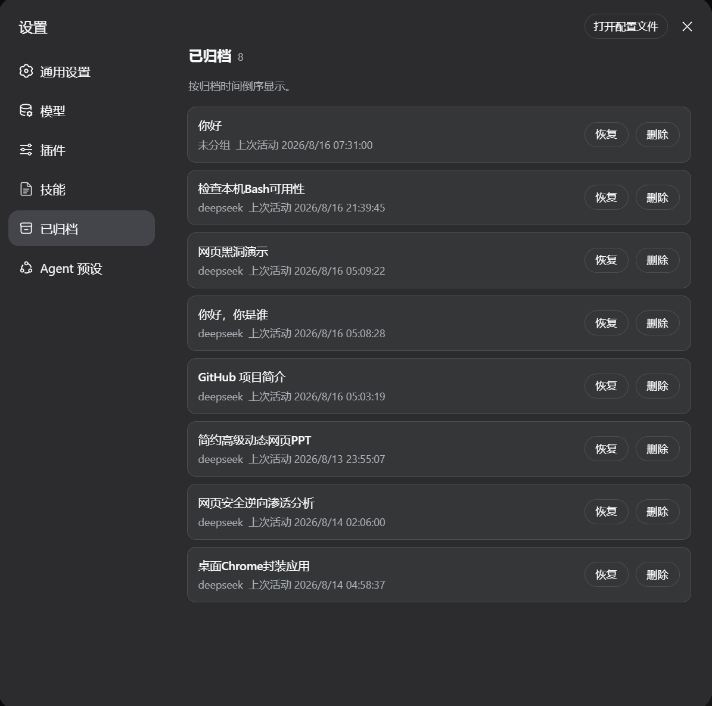

# dsh-archived-sessions

View, restore, and delete archived sessions from the DSH web settings panel,
plus a companion CLI.

DeepSeek Harness (DSH) archiving only hides a session from the sidebar groups:
the local log files and the `workspace.sessionIds` slot are kept. This plugin
closes the two gaps:

- **Restore**: removes the session from the archive set only, so it returns to
  its original workspace and position.
- **Delete**: removes `~/.dsh/sessions/<project>/<session-id>/` session log
  directory, the workspace slot, and the archive entry (irreversible).

Restore and delete operate on one session at a time; there is no multi-select.

The plugin also registers a runtime embedded skill (`dsh-archived-sessions`)
that teaches the model how to use the CLI; its body matches
`skills/dsh-archived-sessions/SKILL.md` in the package.

## Screenshot



## Install

Install the tgz release asset:

```bash
dsh plugin --profile web add https://github.com/Fishquito7/dsh-archived-sessions/releases/download/v0.1.1/dsh-archived-sessions-0.1.1.tgz
```

> The examples default to `--profile web`; replace `web` with your profile
> name when using another profile.
>
> Installing directly from the Git repository is not recommended: pnpm 11
> refuses git-hosted dependencies from running prepare build scripts by
> default. The release tgz already contains the compiled output.

After installing, restart `dsh web` and refresh the page. Open **Settings →
Archived** (between “Skills” and “Agent Presets”). The nav icon reuses the
sidebar “Archive conversation” icon and follows the settings-menu theme
variable.

## CLI

```bash
dsh-archived list                         # list archived sessions, newest archive first
dsh-archived restore <session-id>         # restore one archived session
dsh-archived delete <session-id> [--yes]  # delete one archived session and its log directory
dsh-archived update [--yes]               # check and update the plugin (default: --profile web)
```

Common options:

```text
--port <n>       DSH web port (default: read ~/.dsh/web.stdout.log, fallback 3080)
--profile <name> update target profile (default: web)
--offline         force offline operation (writes local files when DSH is not running)
--json           list as JSON
--yes             skip confirmation
```

- Write commands prefer the running DSH Typert endpoints so the web UI stays
  consistent. When DSH is not running they fall back to offline mode; when
  DSH is running but the plugin is not mounted, offline writes are refused to
  avoid the running gateway overwriting disk later.
- `update` resolves the latest version from the GitHub Releases `latest`
  redirect and installs the conventional
  `dsh-archived-sessions-<version>.tgz` release asset when a newer version
  exists.
- Every time the Archived settings page is entered, the UI performs one silent
  version check. A small banner appears only when an update is available;
  failures and “already latest” show nothing.

## Build a release package

```bash
pnpm install
pnpm build
pnpm pack
```

The artifact is `dsh-archived-sessions-<version>.tgz`. Attach it to a GitHub
Release with a `v<version>` tag (for example `v0.1.1`) and keep the asset name
convention.

## Compatibility

Built against DSH `0.1.0-rc.6`. Restore relies on a capability patch over the
`workspaceRegistry` instance (reusing its `enqueueOperation` / `setState`
write chain). Switch to the official APIs once DSH ships unarchive / delete.

## License

[MIT](LICENSE)
